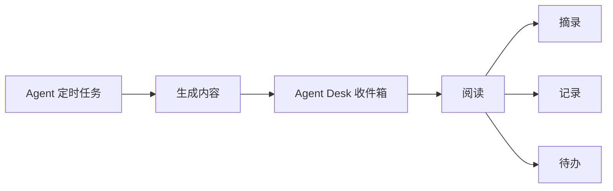
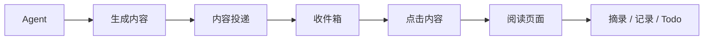
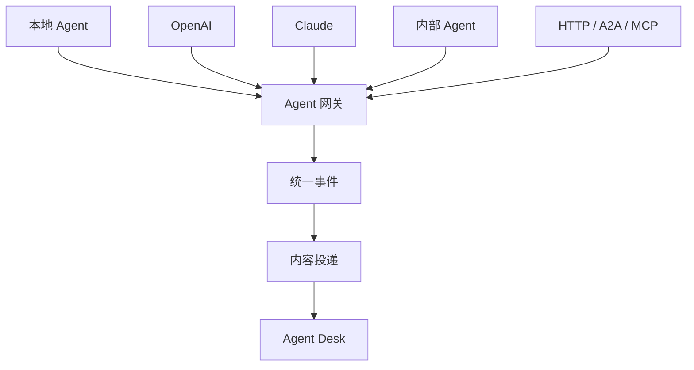
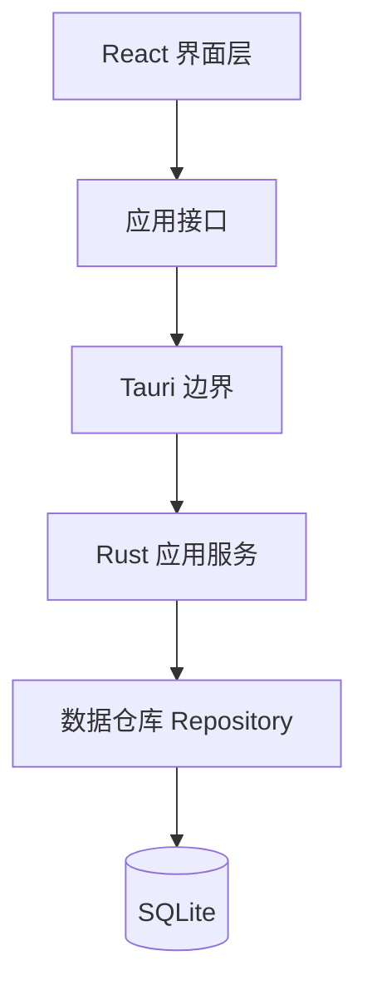
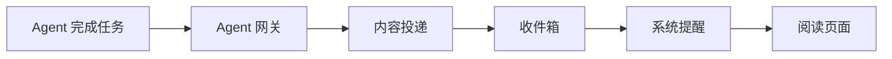
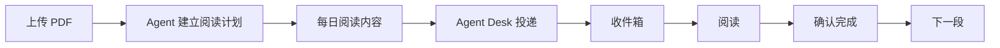

# Agent Desk

> 一个用来接收、阅读和处理 Agent 工作结果的桌面应用。

Agent Desk 是我独立设计，并通过 **Vibe Coding** 持续开发的一款面向 Windows / macOS 的 Agent 桌面应用。

我希望把 Agent 定时生成的阅读材料、研究报告和任务结果，从聊天窗口中拿出来，放进一个排版更舒服、可以长期悬浮在桌面的窗口中，让用户能够在同一个地方完成**接收、阅读、摘录、记录和待办管理**。

简单来说，它想做的是：

```text
Agent 在后台工作
        ↓
生成报告 / 阅读材料 / 任务结果
        ↓
     Agent Desk
        ↓
接收 → 阅读 → 摘录 → 记录 → 待办
```


---

## 产品定位

现在的 Agent 已经可以帮用户定时搜索资料、整理内容、生成报告，甚至持续执行一些后台任务，但这些结果最后往往还是回到聊天窗口或者 IM 中。

Agent Desk 希望为这些内容提供一个更适合消费的桌面入口。

我希望它不是另外一个 AI 对话框，而是一个可以长期放在桌面上的轻量页面：Agent 负责在后台获取和处理信息，Agent Desk 负责把结果清晰地送到用户面前。

它同时融合了阅读页面、便利贴和笔记本的部分能力，让 Agent 的工作结果不只是“被生成”，而是能够真正被用户继续阅读和处理。

---

## 为什么做这个产品

这个产品来自我自己使用 Agent 定时任务时遇到的问题。

我会让 Agent 定时整理资料或者推送一些阅读内容，但实际使用过程中发现，很多内容在 IM 或聊天窗口中的排版并不适合长时间阅读。随着定时任务越来越多，未读内容也会不断堆积，最后反而形成新的阅读压力。

另外，在真正阅读这些内容的时候，我经常还需要记下一句话、记录自己的想法，或者顺手创建一个 Todo，但这些操作往往又分散在聊天窗口、笔记软件和待办工具之间。

所以我希望设计一个长期悬浮在桌面的 Agent 个人阅读页面，把这些原本分散的操作集中到一个轻量界面中。



核心想法是：

> **Agent 负责生产内容，Agent Desk 负责让这些内容真正被看见和使用。**

---

## 核心功能

### 1. 阅读页面 + 悬浮便利贴

产品采用“**阅读页面 + 悬浮便利贴**”的双层结构。

视觉上，我希望它更像现实中的一张纸上贴着一张便利贴，而不是传统软件中的侧边栏或者浮动工具栏。

```text
┌────────────────────────────┐
│                            │
│        阅读页面            │
│                            │
│              ┌──────────┐  │
│              │ 便利贴   │  │
│              │ Todo     │  │
│              │ 记录     │  │
│              └──────────┘  │
│                            │
└────────────────────────────┘
```

阅读页面和便利贴是两个独立图层，便利贴可以覆盖在阅读内容上方，不需要让正文为了便利贴重新排版。

---

### 2. 三种便利贴状态

便利贴目前支持：

**Mini → Compact → Expanded**

三种形态。

Mini 状态尽量降低对阅读的干扰，只显示日期和当前待办数量；Compact 状态可以快速查看 Todo 和一条便签短句；Expanded 状态则可以进入完整的记录和待办管理。

目前便利贴支持：

* 长记录创建、编辑和保存
* Todo 创建与完成
* 截止日期
* Todo 拖动排序
* 一条独立的便签短句
* Markdown 文件导出
* 本地持久化
* 应用重启后恢复

便利贴的 Mini 状态会固定在阅读页面顶部的安全区域，避免在阅读滚动过程中持续遮挡正文。

---

### 3. 纸张式阅读页面

阅读页面采用偏纸张式的 Markdown 阅读体验，目前支持：

* 标题和正文
* 列表
* 引用
* 代码块
* 行内代码
* 链接
* 字号调整
* 行距调整
* 浅色 / 深色 / 跟随系统
* 网格纸背景
* 纸张纹理

用户还可以点击“**隐藏正文**”，暂时把阅读内容收起来，只保留一张干净的纸和便利贴；再次点击“显示正文”后，会恢复之前的阅读位置。

---

### 4. 阅读过程中直接保存摘录

用户在阅读时可以直接选择一段文字。

选中以后，页面只提供两个操作：

```text
复制
保存到记录
```

保存到记录时，会保留用户真正选中的原始文字，不自动改写、总结或者润色。

同时，记录和它来自哪一篇阅读内容的来源关系会分别保存。

```text
阅读内容
   ↓
选中文字
   ↓
保存到记录
   ↓
记录正文
   +
来源关系
```

这样未来可以继续实现“从记录回到原文”等功能。当前文字复制、跨段摘录和代码内容保存已经完成原生验证。

---

### 5. 内容投递和收件箱

目前产品已经进一步完成了**内容投递和收件箱**的主体能力。

这里我把“内容是什么”和“内容什么时候被送到用户面前”拆成了两层：

```text
阅读文档 ReaderDocument
=
内容本身

投递 Delivery
=
一次内容送达行为
```

这样做是因为同一篇内容和一次投递行为并不是同一个概念。

未来 Agent 可能因为网络问题重新发送，也可能通过定时任务、系统通知或者其他方式多次进行投递，所以投递状态不应该直接写进内容本身。

目前收件箱已经支持：

* 未读 / 已读状态
* 未读数量
* 按投递时间排序
* 内容来源
* 内容类型
* 投递时间
* 点击内容直接进入阅读页面
* 防止重复投递

当前阅读内容和投递行为已经作为独立领域对象进行管理。

完整流程为：



---

## 和其他产品有什么不同

Agent Desk 不是一个新的笔记软件，也不是单纯的电子书阅读器，更不是另外一个 Agent Chat UI。

它更像是这几个产品之间的连接层。

大部分 Agent 产品主要关注：

```text
用户
 ↓
Agent
```

也就是用户如何和 Agent 对话、如何给 Agent 下任务。

Agent Desk 更关注的是另一侧：

```text
Agent
 ↓
用户
```

也就是：

> **Agent 已经把事情做完以后，这些结果应该去哪里？**

用户可以一边阅读 Agent 投递的内容，一边使用悬浮便利贴管理自己的记录和任务。

未来不同 Agent 的结果也不会各自控制一套 UI，而是先通过统一的 Agent 网关和适配器转换成 Agent Desk 可以理解的统一事件，再进入相同的投递和阅读流程。



这一层目前还是后续规划，真实 Agent Gateway 尚未开始实现。当前架构已经为这一方向预留统一边界。

---

## 技术实现

Agent Desk 当前主要使用：

* **Tauri 2**
* **React**
* **TypeScript**
* **Rust**
* **SQLite / SQLx**
* **Tauri Store**
* **Vite**
* **Vitest**
* **GitHub Actions**

整体采用本地优先架构。

React 主要负责界面展示和本地交互，Rust / Tauri 负责原生能力、业务服务和数据持久化边界，SQLite 负责保存记录、待办、阅读内容、来源关系和投递记录。



React 不直接访问 SQLite，数据读写统一经过应用接口和 Rust 服务。这样的好处是界面逻辑和持久化逻辑不会逐渐混在一起，也方便未来接入新的 Agent 或新的数据来源。

---

## 一些工程设计

虽然这是一个通过 Vibe Coding 开发的个人项目，但我不希望它只是一个可以演示 UI 的 Demo，所以开发过程中也加入了一些比较基础的软件工程约束。

### 本地持久化

记录、Todo、阅读内容、内容来源和投递信息等业务数据统一保存到 SQLite。

主题、字号、行距、当前阅读状态等轻量界面偏好则通过 Tauri Store 保存。

---

### 数据库只追加迁移

数据库结构采用只追加 Migration 的方式升级。

已经发布的旧 Migration 不直接修改，而是：

```text
0001
 ↓
0002
 ↓
0003
 ↓
0004
 ↓
0005
```

逐步演进。

这样可以真实验证旧版本应用中的数据升级到新版本以后是否仍然能够正常使用。

---

### 事务一致性

一些必须同时成功的数据会放到一个事务中处理。

例如：

```text
保存阅读摘录

创建记录
+
创建来源关系
```

以及：

```text
收到 Agent 内容

创建阅读文档
+
创建投递记录
```

如果其中一步失败，整个操作都会回滚，避免留下只有一半的数据。

---

### 防重复投递

未来 Agent 在发送结果时，可能因为超时发生重试。

所以内容投递从第一版开始就加入了幂等机制。

```text
第一次发送
→ 创建内容

相同内容再次发送
→ 不重复创建

同一个标识却发送不同内容
→ 返回冲突
```

目前相关的数据层和自动化测试已经完成。

---

## 当前阶段

目前已经完成一个可以运行的桌面 MVP。

便利贴部分已经完成长记录、Todo、截止日期、排序、便签短句和 Mini / Compact / Expanded 三种形态；阅读页面已经完成 Markdown 阅读、隐藏正文、阅读恢复、文字摘录和来源关系；内容投递和收件箱主体链路也已经落地。

当前 M2-C 阶段本地自动化结果：

```text
前端测试    74 项通过
Rust 测试   33 项通过
Clippy      通过
生产构建    通过
```

目前 M2-C 主体功能已经实现，但最终 Native Smoke 和 Windows / macOS CI Gate 仍然没有完全闭环，因此当前不会把这一阶段标记为最终完成，也尚未进入真实 Agent Gateway 开发。

---

## 后续规划

下一阶段计划接入**本地 Agent 网关和系统通知**，真正跑通：



到这个阶段以后，Agent Desk 才会真正从一个具备投递结构的桌面应用，变成可以接收真实 Agent 工作结果的产品。

---

## Progressive Reading Skill

后续还计划接入我已经设计并验证的 **Progressive Reading Skill**。

这是一个渐进式 PDF 阅读 Skill。

用户上传一本 PDF，并告诉 Agent 每天希望阅读多少分钟、希望什么时候收到内容以后，Agent 会根据：

```text
时间预算
+
内容难度
+
阅读速度
+
语义完整性
```

规划每天应该阅读到哪里。

它的核心原则是：

> **语义完整性优先于精确阅读时间。**

例如用户选择每天阅读 10 分钟，Agent 不会简单按照固定字数把文章从一个完整意思中间截断，而是优先保证每天阅读内容的完整性。

同时，正文必须直接来自原始 PDF，Agent 可以判断“从哪里开始、到哪里结束”，但不能偷偷改写作者原文。

未来它和 Agent Desk 的完整体验会是：



---

## 产品设计思路

Agent Desk 最核心的原则是：

> **Agent 负责理解和生产，Desk 负责呈现和交互。**

本质上，我想给 Agent 做一个放在桌面上的小插件。

我刻意避免把它做成另一个 AI 对话框，而是从人的注意力和真实桌面使用习惯出发，用纸张、便利贴这些现实生活中已经非常熟悉的东西承载 Agent 的结果。

纸和便利贴的特点是，它们不会一直催你互动，也不会持续抢你的注意力。它们只是安静地放在那里，需要的时候再拿起来看。

我希望 Agent Desk 也是这样的产品。

同时，在技术设计上，我也尽量把内容、投递、界面状态和 Agent 协议拆开，让产品未来可以从一个单 Agent Demo 逐渐扩展成多个 Agent 共用的桌面入口。

---

## 开发方式

这是一个通过 Vibe Coding 开发的个人项目。

在整个开发过程中，我主要负责：

* 产品定义
* 用户流程
* 交互设计
* 信息架构
* 领域模型设计
* 技术方案讨论
* 开发阶段拆分
* 验收标准
* 实机产品体验
* Bug 判断与迭代

Coding Agent 负责具体代码实现。

整个开发过程更接近：

```text
产品想法
 ↓
产品与架构设计
 ↓
拆分开发 Gate
 ↓
Coding Agent 实现
 ↓
自动化测试
 ↓
原生应用验证
 ↓
产品体验
 ↓
下一轮迭代
```

而不是通过一条 Prompt 一次性生成整个应用。

这个项目也是我对 **AI 时代产品设计与软件开发协作方式**的一次实践。

---

## 项目状态

```text
便利贴                    ✅
阅读页面                  ✅
文字摘录与记录            ✅
隐藏正文 / 阅读恢复       ✅
内容投递                  ✅ 主体完成
收件箱                    ✅ 主体完成
真实 Agent Gateway        ⏳
系统通知                  ⏳
Progressive Reading 接入  ⏳
多 Agent 接入             ⏳
```

---

## 最后

Agent Desk 最终想回答的是一个很简单的问题：

> **当未来一个人同时拥有很多 Agent，它们完成的工作应该去哪里？**

我的设想不是让用户每天重新打开十个 Agent 聊天窗口。

而是让 Agent 各自在后台工作。

重要的结果，最后来到同一张桌面。
